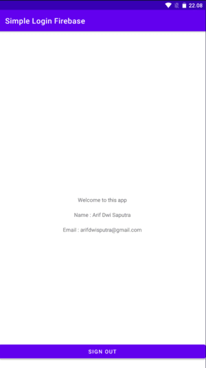

# Simple Android Login Register with Firebase

`{width=50%}`
{width=50%}
{width=50%}

This is a simple Android application for user authentication built using Firebase Authentication. It includes features for user registration, login, and a basic main screen.

## Table of Contents

- [Features](#features)
- [Screenshots](#screenshots)
- [Getting Started](#getting-started)
- [Prerequisites](#prerequisites)
- [Installation](#installation)
- [Usage](#usage)

## Features

- **User Registration**: Users can create an account with their email and password.
- **User Login**: Registered users can log in with their credentials.
- **Main Screen**: A basic main screen as a placeholder for your app's functionality.
- **Firebase Integration**: Utilizes Firebase Authentication for user management.

## Screenshots

### Registration
{width=50%}

### Login
{width=50%}

### Main Screen
{width=50%}

## Getting Started

Follow these instructions to get a copy of the project up and running on your local machine for development and testing purposes.

### Prerequisites

Before you begin, ensure you have met the following requirements:

- **Android Studio**: You should have Android Studio installed.
- **Firebase Account**: Create a Firebase project and set up Firebase Authentication. You'll need to add your Firebase configuration file to the project.

### Installation

1. Clone the repository:

   ```bash
   git clone https://github.com/arifdwi/Simple-Login-Register-Firebase.git
2. Open the project in Android Studio.
3. Add your Firebase configuration file to the project as per Firebase documentation.
4. Build and run the application on an emulator or physical device.

### Usage
- Register: Use the "Register" button to create a new user account.
- Login: Use the "Login" button to access your account.
- Main Screen: Customize the main screen to include your app's functionality.

Feel free to modify and expand upon this project to suit your specific requirements.
